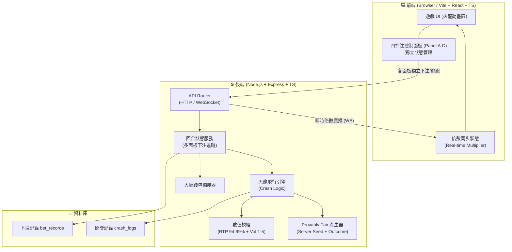
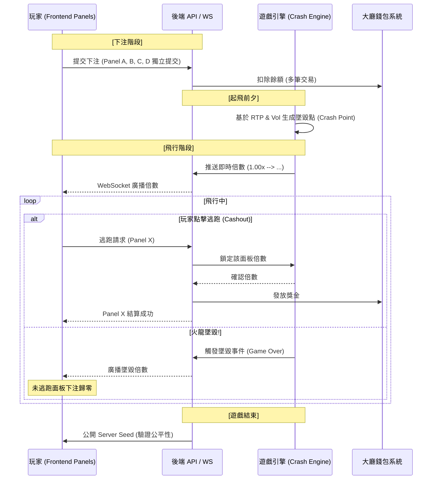

# rocketLH (飛天火龍) - 專案提案書 (Proposal)

## 1. 專案背景與目標
本專案旨在開發一款高品質、多押注介面的 Crash 類型遊戲「rocketLH」。玩家觀察火龍（火箭）飛行，期待倍數增長並在隨機發生的「墜毀」前撤回賭注。
此遊戲核心特色支援**同一遊戲局內四個獨立押注介面**，提供玩家多樣化的投注策略組合。

## 2. 遊戲核心規則
- **遊戲類型**：增量式倍數 (Crash/Rocket) 遊戲。
- **遊玩流程**：
  1. 玩家在倒數期間於任一（或多個）押注面板下注。
  2. 火龍起飛，倍數從 1.00x 開始隨機增長。
  3. 玩家需在火龍墜毀前點擊「逃跑 (Cashout)」以獲取獎金。
  4. 越早離開倍數越小，墜毀則該局下注全數沒收。
- **獨家特色：四押注介面**：
  - 同一場遊戲具備四個獨立的押注控制面板（Panel A, B, C, D）。
  - 四個介面共用火龍飛行倍數，但可獨立設定下注金額與手動逃跑。
  - 用途：例如 Panel A 設定低倍數自動逃跑保底，Panel B 嘗試搏取高倍數。

## 3. 數學模型與變異數系統
### 3.1 RTP 設定
後端支援六段式 RTP 調整，精準控制收益：
- **可選 RTP**：`94%`, `95%`, `96%`, `97%`, `98%`, `99%`。

### 3.2 變異數 (Volatility) 設定
提供 1-5 等級的變異數設定，影響倍數增長的分配曲線：
- **等級 1：底波動** - 倍數穩定增長，極高機率在初期（1.01x - 2.00x）結束，鮮少出現超高倍數。
- **等級 2：中低波動** - 適合保守型玩家。
- **等級 3：中波動** - 標準平衡設定（預設）。
- **等級 4：高波動** - 初期墜毀機率增加，但出現中大型倍數（50x+）的機會提升。
- **等級 5：最高波動** - 極端分配，經常開局即墜毀，但一旦起飛，更有機會挑戰極高倍數（1000x+）。

## 4. 系統技術架構
### 4.1 前端 (Frontend)
- **技術棧**：Vite + React + TypeScript。
- **整合規格**：
  - **Base URL**：`/rocketLH/`
  - **Mobile Route**：`/rocketLH/m/` (強制載入 Mobile Pro UI)
  - **PWA**：支援 Manifest 定義與 Service Worker 緩存。
- **UI 組件**：
  - **核心動畫區**：SVG 火箭飛行（金屬漸層機身 + 紅色鼻錐 + 動態火焰）、背景動態流星與特效。
  - **四押注面板區**：四組結構對稱的押注控制項。
  - **即時數據區**：該局所有面板的獲利狀態、歷史開獎記錄。

### 4.2 Mockup 預覽

````carousel

<!-- slide -->

<!-- slide -->

<!-- slide -->

<!-- slide -->

<!-- slide -->

<!-- slide -->

<!-- slide -->

````

### 4.3 後端 (Backend)
- **技術棧**：Node.js + Express + TypeScript。
- **機率引擎**：
  - 結合 RTP 與 Volatility 參數生成每局墜毀點。
  - 確保 Provably Fair (可證明公平) 性。

## 5. UI 設計規範
- **視覺風格**：火光、煙霧與星際太空感，深紫色與金橘色對比。
- **佈局**：
  - 頂部：SVG 火箭飛行主動畫（75° 朝向，30° 飛行軌跡）。
  - 中間：BalanceBar（餘額 + REBET）+ 四押注面板（2x2 矩陣，無面板標題）。
  - 底部：最近十局倍數、玩家獲利榜單。
  - 音效：Web Audio API 合成音效（6 種），TopBar 靜音按鈕。

## 6. 開發階段規劃
1. **Phase 1: 環境建置與核心演算法**
   - 初始化 GitHub Repository。
   - 建立 Vite + Node.js Monorepo 環境。
   - 完成 RTP 機率計算 Utils（涵蓋組合數學實作與單元測試）。
2. **Phase 2: 後端邏輯與公平機制**
   - 實作 Provably Fair (可證明公平) 的生成邏輯。
   - 建立遊戲流程的 API 端點 (Start, Pick, Cashout)。
3. **Phase 3: 前端實作與特效**
   - 建立支援 TailwindCSS 的高品質遊戲介面 (Premium UI)。
   - 串接後端 API，完成完整遊戲的 Lifecycle。
4. **Phase 4: 測試與優化**
   - E2E 流程驗證。
   - 在各 RTP 參數下進行大量自動化投注模擬，驗證最終的回報率是否精準貼合設定值。


## 7. 系統架構圖



---

## 8. 遊戲流程圖



---

## 9. 資料結構範例

### 📜 註單記錄 (bet_records)
當玩家在任一面板下注時建立。由於本遊戲支援單局多介面下注，每局遊戲（Session）可對應多筆註單記錄。

```json
{
  "betId": "BET-ROCKET-20260317-P1",
  "sessionId": "SESSION-LH-88888",
  "playerId": "user_999",
  "panelId": "A",
  "betAmount": 50.00,
  "rtpSetting": 97,
  "volatilityLevel": 3,
  "status": "active",
  "autoCashout": 2.00,
  "createdAt": "2026-03-17T19:30:00.000Z"
}
```

### 🏆 結算記錄 (settlements)
當玩家手動逃跑、觸發自動逃跑或火龍墜毀時寫入。

```json
{
  "settlementId": "SETTLE-ROCKET-20260317-S1",
  "betId": "BET-ROCKET-20260317-P1",
  "outcome": "win",
  "cashoutMultiplier": 1.85,
  "payout": 92.50,
  "profit": 42.50,
  "settledAt": "2026-03-17T19:35:10.000Z"
}
```

### 🔍 開獎紀錄 (crash_logs)
保存整局遊戲（Session）的最終開獎結果，所有面板共用此紀錄。

```json
{
  "drawId": "CRASH-LOG-20260317-D1",
  "sessionId": "SESSION-LH-88888",
  "crashMultiplier": 5.42,
  "serverSeed": "c3f8e9a2b1d0...",
  "serverSeedHash": "d8e9f2a1...",
  "clientSeed": "player_random_nonce",
  "createdAt": "2026-03-17T19:30:00.000Z",
  "crashedAt": "2026-03-17T19:35:15.000Z"
}
```

---

## 10. 變異數與 RTP 賠率對照表 (Volatility & Multiplier Table)

> 下表顯示在特定變異數 (Volatility) 等級與 RTP 97% 設定下，達到特定倍數的預期機率（Survival Probability）。

| 目標倍率 (Multiplier) | LV.1 (低波動) | LV.2 (中低) | LV.3 (中波動) | LV.4 (高波動) | LV.5 (極高) |
|:---:|:---:|:---:|:---:|:---:|:---:|
| **1.10x** | 88.0% | 87.0% | 86.0% | 84.0% | 80.0% |
| **1.50x** | 64.0% | 63.0% | 61.0% | 58.0% | 52.0% |
| **2.00x** | 48.0% | 47.0% | 45.0% | 42.0% | 35.0% |
| **5.00x** | 18.0% | 19.0% | 19.4% | 19.5% | 18.5% |
| **10.0x** | 5.0% | 7.5% | 9.0% | 10.5% | 12.0% |
| **50.0x** | 0.1% | 0.8% | 1.5% | 2.5% | 3.5% |
| **100x** | 0.01% | 0.2% | 0.8% | 1.5% | 2.5% |
| **1000x** | 0.00% | 0.01% | 0.05% | 0.15% | 0.50% |

### 🔍 數據分析與模型特性
- **低波動 (LV.1)**：極度偏重初期生存。雖然有 88% 的機率能撐過 1.10x，但在大倍數（50x+）幾乎不可能達成。
- **高波動 (LV.5)**：典型的「高風險高報酬」。初期墜毀 (Instant Crash) 機率顯著提高，但分配曲線長尾化，達成 1000x 的機率比 LV.1 提高超過 50 倍以上。
- **RTP 調整影響**：若 RTP 下調（如 94%），全表機率將依比例平均下修；反之 99% 則會提升生存率。

---

## 11. 全 RTP 等級賠率對照表 (RTP Multiplier Comparison)

> 下表顯示在 **變異數 LV.3 (中波動)** 設定下，不同 RTP 等級對達成目標倍數之「生存機率」的影響。
預設建議設定為 **97%**。

| 目標倍率 (Multiplier) | RTP 94% | RTP 95% | RTP 96% | RTP 97% (預設) | RTP 98% | RTP 99% |
|:---:|:---:|:---:|:---:|:---:|:---:|:---:|
| **1.10x** | 83.3% | 84.1% | 85.1% | 86.0% | 86.9% | 87.8% |
| **1.50x** | 59.1% | 59.8% | 60.4% | 61.0% | 61.7% | 62.3% |
| **2.00x** | 43.6% | 44.1% | 44.5% | 45.0% | 45.4% | 45.9% |
| **5.00x** | 18.2% | 18.5% | 18.9% | 19.4% | 19.8% | 20.3% |
| **10.0x** | 8.41% | 8.56% | 8.78% | 9.00% | 9.22% | 9.45% |
| **20.0x** | 4.08% | 4.19% | 4.31% | 4.45% | 4.60% | 4.76% |
| **50.0x** | 1.35% | 1.40% | 1.45% | 1.50% | 1.56% | 1.62% |
| **100x** | 0.65% | 0.71% | 0.76% | 0.80% | 0.85% | 0.91% |

### 🔍 RTP 對數學模型之意義
- **莊家優勢 (House Edge)**：RTP 97% 意味著莊家長期優勢為 3%。
- **波動性與 RTP 的關係**：RTP 決定了整體的「返還總量」，而變異數 (Volatility) 決定了這些返還量是如何分布的。
- **調整邏輯**：當系統由 97% 下調至 94% 時，玩家在所有階段的生存機率均會下降，其中在高倍數區域（20x 以上）的下降感會更為明顯。

---

## 12. v1.5 更新紀錄 (2026-03-18)

### 文件修正
1. **Base URL 修正**：前端整合規格的 Base URL 從 `/mine-game/` 修正為 `/rocketLH/`，Mobile Route 從 `/mine-game/m/` 修正為 `/rocketLH/m/`。

---

## 13. v1.6 更新紀錄 (2026-03-19)

### 遊戲機制變更
1. **回合計時調整**：等待 5s→3s, 下注 8s→20s, 新增 1 秒 "NO MORE BET" 暫停。
2. **火箭動畫**：SVG 火箭取代龍 emoji（金屬漸層 + 紅鼻錐 + 動態火焰）。
3. **音效系統**：Web Audio API 合成 6 種音效，TopBar 靜音按鈕。
4. **UI 重構**：移除面板標題、BetPanel 單行佈局、紫色 Auto Cashout toggle、BalanceBar + REBET、Overlay 定位 PanelGrid 內。
5. **WebSocket 雙向通訊**：新增 Client→Server 訊息（register, place_bet, cashout, update_auto_cashout）。
6. **Volatility 參數修正**：LV.1/LV.5 Beta 分佈 α/β 對調。
7. **DB 表名前綴**：所有表名加 `rocketlh_` 前綴。
8. **Gateway WS 代理**：改用 createServer + server.on('upgrade') 手動處理。

---

## 14. v1.7 更新紀錄 (2026-03-19)

### 動畫與視覺優化
1. **動畫區域高度**：電腦版 `clamp(200px, 49vh, 585px)`, 手機版 `clamp(180px, 35vh, 300px)`。
2. **飛行角度**：電腦版 8° 升空 / 手機版 30° 升空，18 秒 linear 動畫，3x 後停在終點。
3. **墜毀動畫**：JS 定位 → 原位閃光 → 翻轉 180° → 垂直墜落，CSS transition + React state 驅動。
4. **倍數顏色系統**：<2x 綠色, 2-10x 金色, ≥10x 紫色, 爆炸紅色。
5. **UI 微調**：Balance 文字簡化、面板標題完全移除、REBET 金色按鈕。

---

---

## 15. v1.8 更新紀錄 (2026-03-20)

### 動畫與火箭視覺升級
1. **墜落動畫重構**：`requestAnimationFrame` 持續追蹤位置，改用 CSS `@keyframes rocket-fall`（閃光→135° 翻轉→45° 右下墜落縮小淡出）。
2. **手機版飛行終點**：30° 升空, `translate(58vw, -33.5vw)`。
3. **火箭 SVG 升級**：RocketSprite.tsx 全面重構 — 8 段金屬漸層、鉚釘、多層玻璃觀景窗、3D 尾翼、鐘形噴嘴、4 層火焰獨立擾動、排氣煙霧粒子、金色裝飾帶（Falcon 9 + 卡通混合風格）。

---

*文件版本：v1.8 | 日期：2026-03-20*
